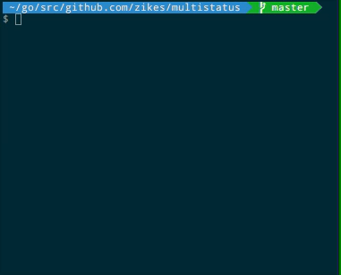

# multistatus

Use the terminal to show the status of multiple concurrent processes in Go.



## Installation

```sh
go get github.com/zikes/multistatus
```

## Example

```go
// Create a new WorkerSet
workerSet := multistatus.New()

// Populate the WorkerSet with Workers
for i := 0; i < 10; i++ {

  // Create and return a Worker
  worker := workerSet.Add(fmt.Sprintf("Task #%d", i))
  go func(w *multistatus.Worker) {
    // Sleep, then finish the worker
    time.Sleep(time.Second * time.Duration(rand.Intn(5)))
    worker.Done()
  }(worker)
}

// Print the WorkerSet's status until all Workers have completed
workerSet.Print(context.Background())
```

## License

MIT
